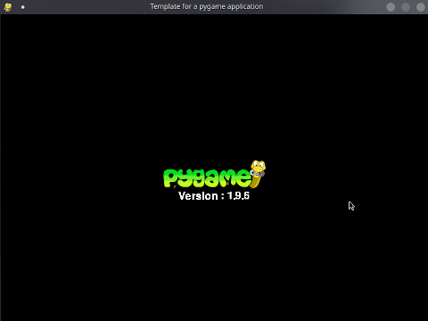

# pygame_framework
This project contain a simple frawework for pygame developement.

This project is build on top of the previous iteration https://github.com/jsomville/pygame_template.

This template shows:
 - How to initialize a project
 - Handle event
 - Use mouse position on a click event
 - Separate game logic from display logic
 - Render a surface
 - Specify a "Frame Per Second" render
 - Define a Scene will all of the above
 - Define a handy color class with most commun colors defined
 
 The features are:
 - Load an image
 - Display background color
 - Display an image
 - Display some text
 - Handle "quit" event
 - Display Circle
 - Change 
 - Handle Scene
