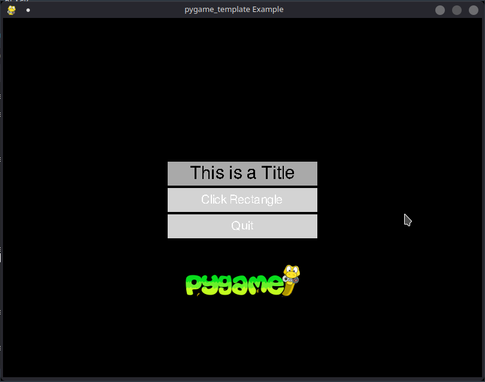

# pygame_framework
This project contain a simple frawework for pygame developement.

## Features
Feature of this framework:
 - Handle Scene (pages within an app)
 - pgame mechanics on a repetable template (update, events, draw)
 - Handle main "quit" event
 - Basic Button mechanism
 - Basic Menu mechanism 

## Installation
The framework requires the following libraries
 - pygame>=2.0.1
 - singleton3>=1.0

## Example
The example shows: (To verify)
 - How to initialize a project
 - Handle event
 - Use mouse position on a click event
 - Separate game logic from display logic
 - Render a surface
 - Specify a "Frame Per Second" render
 - Define a Scene will all of the above
 - Define a handy color class with most commun colors defined
